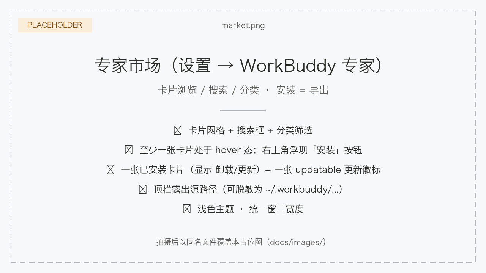
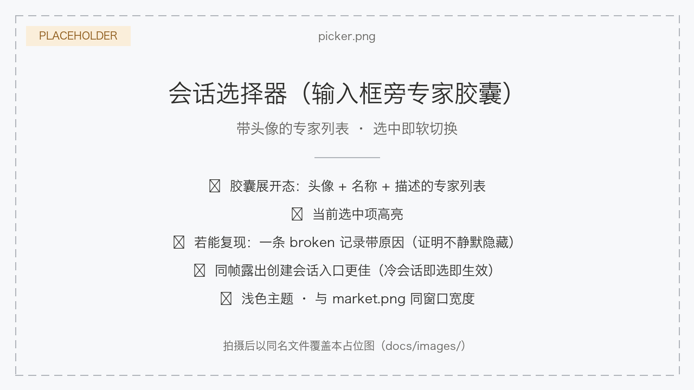
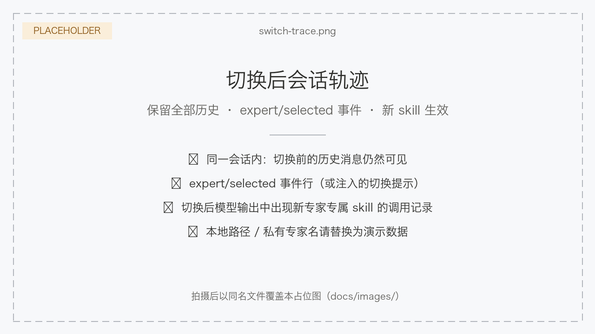

<div align="center">

# DSH WorkBuddy Expert

**Bring WorkBuddy experts into DSH: one-click import from the expert market · switch experts anytime via the session selector**

[中文](README.md) · [Features](#features) · [Installation](#installation) · [Design doc](docs/design.md) · [MIT](LICENSE)

[](LICENSE)
[](#installation)
[](#development)

</div>

> DSH WorkBuddy Expert is a community-maintained [DeepSeek Harness](https://github.com/deepseek-ai/deepseek-harness) (DSH) plugin, not an official DeepSeek AI product.

<!-- Demo gif (placeholder): summon → install → select → effective. Replace docs/images/hero-demo.gif with a real recording, same filename. -->


## What it is

A DSH web plugin that brings the experts from the [WorkBuddy](https://www.workbuddy.cn/) Expert Center into your DSH workflow:

- **Expert market** (Settings → WorkBuddy Experts) — a read-only scan of your local WorkBuddy expert directory, with card browse/search/categories and one-click **install / update / uninstall** that exports into standard expert folders;
- **Session selector** — the expert capsule next to the composer switches the current session's expert anytime: the role section and skills are swapped as one group, **the full session history is kept**, and the change takes effect at the next model-request boundary without interrupting an in-flight turn;
- **A complete expert experience** — installed experts carry their role description, dedicated skills, and avatar; the selector list is ready to use right away.

## Features

### 1. WorkBuddy expert market (Settings → WorkBuddy Experts)



- **Read-only scan** of your local WorkBuddy expert directory (default `~/.workbuddy/plugins/marketplaces/experts/plugins`) — never written to, zero data egress;
- Card browse/search/categories; action buttons live on the card's top-right corner and appear on hover/focus (not installed → Install; installed → Uninstall/Update);
- **Install = export** into a standard expert folder at `~/.dsh/experts/<id>/` (expert.yml + sanitized role.md + the whole skills tree + `avatar.png` when the source card has a PNG), with the fingerprint manifest in `.expert-source.json`;
- **Update**: cards light up updatable when the source changed; update is an in-place re-export. **Uninstall**: deletes the expert folder;
- **Orphans**: after switching sources, experts installed from another source are listed under "installed but not in the current source" — listed only, never blocking.

### 2. Session selector (with avatars)



- The expert capsule next to the composer expands into an avatar-carrying expert list; picking one switches the current session's expert;
- Avatars are exported at install time (`avatar.png`, fetched on demand via `/api/expert-avatar`); no avatar falls back to an emoji;
- **Switching keeps the full session history**: the role section and skills are swapped as one group, taking effect at the next model-request boundary; an in-flight turn queues the switch until its boundary, never interrupting streaming output;
- Switch transactions are serialized: one switch per session at a time;
- Every registration lands in agent scope: it affects only the current session and unwinds automatically when the session ends;
- You can also pick an expert when creating a new session — it composes immediately on creation, so a cold session never sits in a "selected but not effective" state;
- No restart needed for added/removed experts — the discovery roots are watched and the selector (composer area + session-creation entry) refreshes itself.

### 3. Expert capabilities ride the session



Once an expert is selected, its capabilities mount onto the current session:

- The **role description** (role.md) is injected as a system-prompt role section;
- **Dedicated skills** (the whole skills/ tree) register and unregister with the expert;
- An optional **tool allowlist** (expert.yml `tools.allow`) mounts a scoped tool restriction that lifts automatically on switch-away;
- Experts with broken manifests are listed as **broken with reasons** in the selector — never silently hidden.

## Quick start

Prerequisites:

- a working DeepSeek Harness Web installation with `dsh` available in your terminal. Examples use the `web` profile; replace it with your target profile;
- the [WorkBuddy](https://www.workbuddy.cn/) desktop app installed on this machine. The plugin reads a **local** expert directory — an expert is only downloaded to `~/.workbuddy/plugins/marketplaces/experts/plugins` after you click **Summon** on it in the WorkBuddy Expert Center. If you have never summoned any expert, the market page will show an empty list.

### Install the plugin

```sh
git clone <this repo>
cd dsh-workbuddy-expert
dsh plugin --profile web add .
dsh --profile web --dump-config
```

`dsh-workbuddy-expert` should appear in the config dump. Then **restart `dsh web`** (the bundle list is read at startup only) and **hard-refresh the browser**. Zero build, zero runtime dependencies.

### Ask an agent to install it

Send this prompt to any agent that can run terminal commands on your machine:

```text
Install the DSH plugin dsh-workbuddy-expert from this repository into my web profile: git clone <repo URL>, then run dsh plugin --profile web add <directory>. After installation, run dsh --profile web --dump-config, confirm the configuration includes dsh-workbuddy-expert, and explain how to restart DSH Web and start using it.
```

### Use a WorkBuddy expert in three steps

1. Open **Settings → WorkBuddy Experts** and confirm the source path points to your local WorkBuddy expert directory (default `~/.workbuddy/plugins/marketplaces/experts/plugins`; editable in the topbar). **Empty list?** That means no expert has been summoned in WorkBuddy yet — go to the WorkBuddy Expert Center and click **Summon** on a few; cards appear automatically once the local directory is populated;
2. Click **Install** on a card — the expert is exported to `~/.dsh/experts/`;
3. Back in a conversation, click the expert capsule next to the composer, pick the freshly installed expert, and start chatting.

The command line works too: `/expert` lists all experts, `/expert <name>` switches.

## Configuration

| Option | Default | Purpose |
|---|---|---|
| `sourcePath` | `~/.workbuddy/plugins/marketplaces/experts/plugins` | WorkBuddy source directory; editable in the market-page topbar or settings (ns `workbuddy-expert`). The tilde is stored verbatim and expanded on use; a nonexistent path may be saved (the page shows a notice until it exists) |
| `roots` | — | Optional extra discovery roots; explicit `trust: user` required |
| `dshHome` | `$DSH_HOME` or `~/.dsh` | Overrides DSH home resolution |

Extra-root example:

```yaml
- name: 'dsh-workbuddy-expert'
  config:
    roots:
      - path: ~/company-experts
        trust: user
```

Per-file fingerprints trigger automatic rescans; the Refresh button forces one.

## Development

```sh
node scripts/smoke.mjs            # contract/sanitize/registry/switch smoke, zero deps
node scripts/smoke-client.mjs     # client side
node scripts/smoke-importer.mjs   # importer/market routes
node scripts/smoke-install.mjs    # install=export pipeline
```

Host-side changes (`src/`, `package.json`) need a `dsh web` restart; client-only changes (`client/client.js`) take effect on page refresh.

| Module | Responsibility |
|---|---|
| `src/registry.js` | Expert-folder scanning, validation, sanitization, watcher |
| `src/compose.js` | Session composition: role section + skills + tool allowlist |
| `src/switch.js` | Switch transaction |
| `src/importer/` | WorkBuddy scanner/fingerprint/export/market routes |
| `client/client.js` | Selector + market-page UI |

Design and decision log: [docs/design.md](docs/design.md).

## License

[MIT](LICENSE) © 2026 dsh-workbuddy-expert contributors
