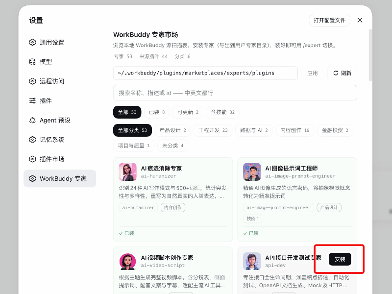
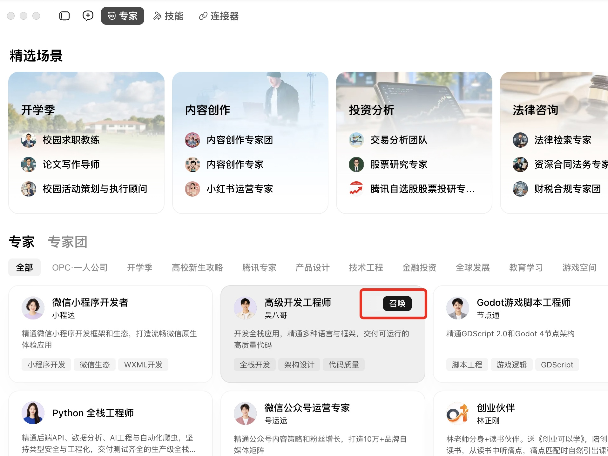
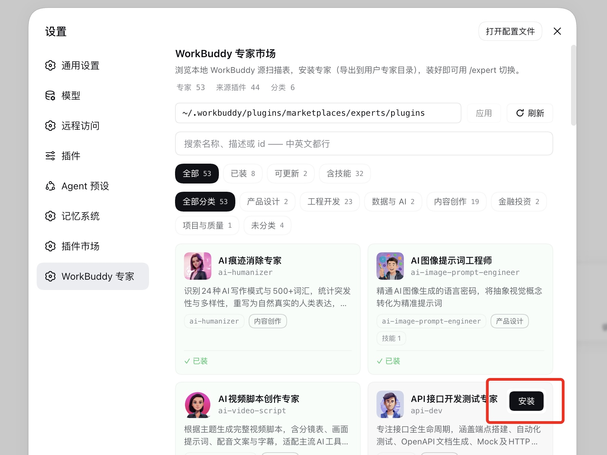
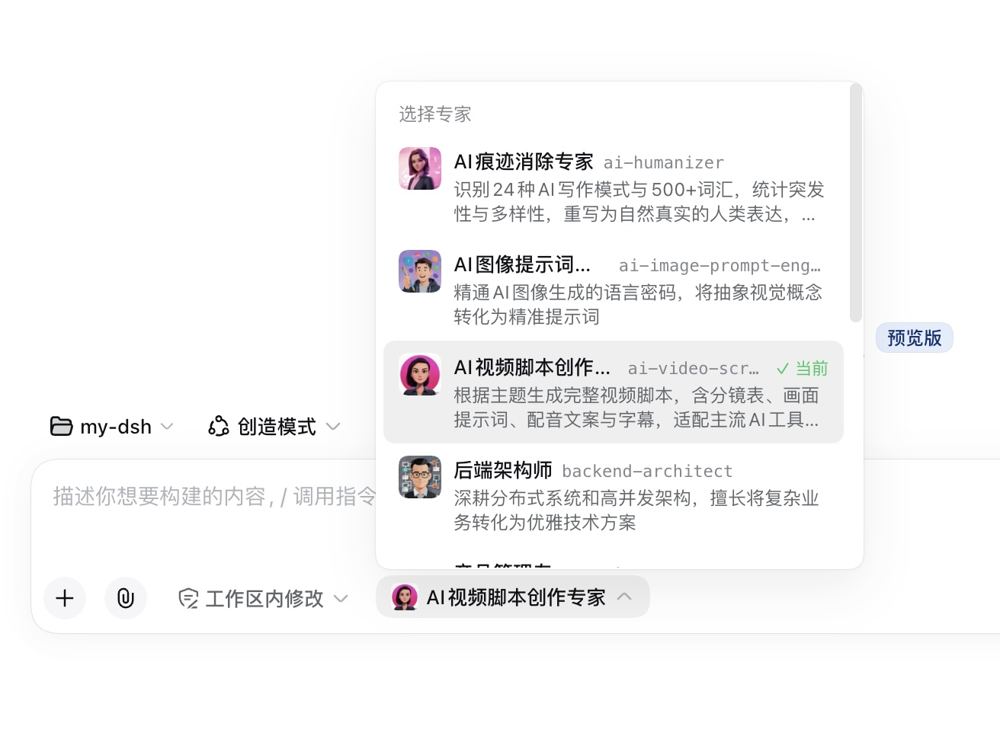
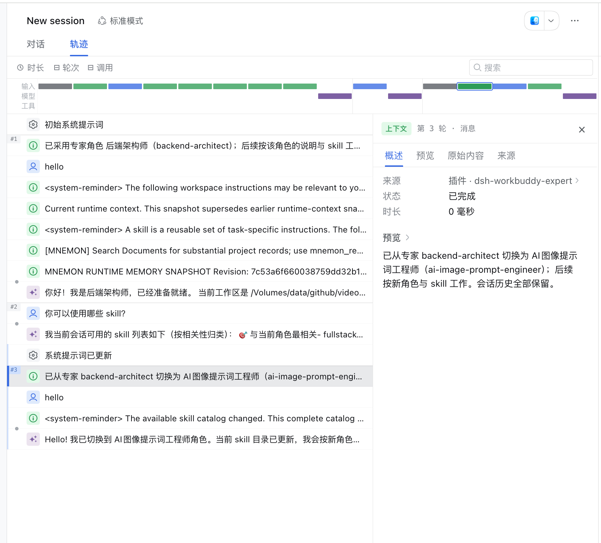

<div align="center">

# DSH WorkBuddy Expert

**把 WorkBuddy 专家装进 DSH：专家市场一键导入 · 会话选择器随时切换**

[English](README.en.md) · [功能](#功能) · [安装](#安装) · [设计文档](docs/design.md) · [MIT](LICENSE)

[](LICENSE)
[](#安装)
[](#开发)

</div>

> DSH WorkBuddy Expert 是社区维护的 [DeepSeek Harness](https://github.com/deepseek-ai/deepseek-harness)（DSH）插件，并非 DeepSeek AI 官方产品。

<!-- 演示动图（占位）：召唤 → 安装 → 选择 → 生效，拍摄后同名覆盖 docs/images/hero-demo.gif -->


## 它是什么

一个 DSH Web 插件，让你把 [WorkBuddy](https://www.workbuddy.cn/) 专家中心的专家带进 DSH 工作流：

- **专家市场**（设置 → WorkBuddy 专家）——只读扫描本地 WorkBuddy 专家目录，卡片浏览/搜索/分类，一键**安装 / 更新 / 卸载**，导出成标准专家文件夹；
- **会话选择器**——输入框旁的专家胶囊，随时切换当前会话的专家：整组替换角色描述与 skills，**保留全部会话历史**，在下一个模型请求边界生效，不打断进行中的轮次；
- **完整专家体验**——安装的专家自带角色描述、专属 skills 与头像，选择器列表即选即用。

## 专家来源

插件**不联网下载专家**——市场页读取的是 WorkBuddy 桌面端落盘的**本地**专家目录（默认 `~/.workbuddy/plugins/marketplaces/experts/plugins`）。专家必须先在 WorkBuddy 的**专家中心**点击**召唤**，WorkBuddy 才会把该专家下载落盘到这个目录，之后本插件才能扫描到它：

<!-- WorkBuddy「召唤」按钮截图（占位）：真图拍摄后同名覆盖 docs/images/workbuddy-summon.jpg -->


一个专家都没召唤过的话，本地目录为空，本插件的市场页相应是空列表——回 WorkBuddy 专家中心召唤几个，目录就位后市场页会自动出现卡片。

## 功能

### 1. WorkBuddy 专家市场（设置 → WorkBuddy 专家）



- **只读扫描**本地 WorkBuddy 专家目录（默认 `~/.workbuddy/plugins/marketplaces/experts/plugins`），绝不写它，零数据外发；
- 卡片浏览/搜索/分类；操作按钮收在卡片右上角，hover/聚焦卡片时浮现（未装 → 安装，已装 → 卸载/更新）；
- **安装 = 导出**成标准专家文件夹到 `~/.dsh/experts/<id>/`（expert.yml + 清洗后 role.md + skills 整树 + 源卡有 PNG 时 `avatar.png`），指纹清单落 `.expert-source.json`；
- **更新**：源有变时卡片亮 updatable，更新 = 就地重导；**卸载** = 删整个专家文件夹；

### 2. 会话选择器



- 输入框旁的专家胶囊展开带头像的专家列表，选中即切换当前会话的专家；
- **切换保留全部会话历史**：角色描述与 skills 整组替换，在下一个模型请求边界生效；轮次进行中则排队到边界后应用，不打断流式输出；
- 切换事务串行化：同一会话同时只允许一次切换；
- 一切注册落在 agent scope 层：只影响当前会话，会话结束自动清理；
- 创建新会话时也可先选专家，创建即生效——冷会话不存在"已选未生效"状态；
- 新增/删除专家无需重启——发现根有 watcher，选择器（输入框区域 + 创建会话入口）自动刷新。

### 3. 专家能力随会话生效



选中专家后，其能力即挂载到当前会话：

- **角色描述**（role.md）作为 system prompt 角色段注入；
- **专属 skills**（skills/ 整树）随专家注册/注销；
- **工具白名单**（expert.yml `tools.allow`，可选）挂载作用域工具限制，切换时自动解除；
- 清单损坏的专家在选择器中列为 **broken 并给出原因**，不静默隐藏。

## 快速开始

前置条件：

- 已可正常运行 DeepSeek Harness Web，且终端可用 `dsh`。示例使用 `web` profile，请替换为实际目标 profile；
- 本机已安装 [WorkBuddy](https://www.workbuddy.cn/) 桌面端。插件读取的是**本地**专家目录——专家必须先在 WorkBuddy 的专家中心点击**召唤**，才会下载落盘到 `~/.workbuddy/plugins/marketplaces/experts/plugins`。一个都没召唤过的话，市场页会是空列表。

### 安装插件

```sh
git clone --depth 1 --branch v0.1.0 https://github.com/pbwheel/dsh-workbuddy-expert.git
cd dsh-workbuddy-expert
dsh plugin --profile web add .
dsh --profile web --dump-config
```

配置输出应出现 `dsh-workbuddy-expert`。然后**重启 `dsh web`**（bundles 列表只在启动时读）并**强刷浏览器**。零构建、零运行时依赖。

### 让 Agent 帮你安装

把下面这段话发给任意能够执行本机终端命令的 Agent：

```text
请将 DSH 插件 dsh-workbuddy-expert 从本仓库安装到 web profile：git clone --depth 1 --branch v0.1.0 https://github.com/pbwheel/dsh-workbuddy-expert.git 后执行 dsh plugin --profile web add <目录>。安装后执行 dsh --profile web --dump-config，确认配置包含 dsh-workbuddy-expert，并告诉我如何重启 DSH Web 和开始使用。
```

### 三步用上 WorkBuddy 专家

1. 打开**设置 → WorkBuddy 专家**，确认源路径指向本地 WorkBuddy 专家目录（默认 `~/.workbuddy/plugins/marketplaces/experts/plugins`，可在顶栏修改）。**列表为空？** 说明 WorkBuddy 里还没召唤过专家——回 WorkBuddy 专家中心点几个**召唤**，本地目录就位后市场页会自动出现卡片；
2. 在卡片上点**安装**——专家即导出到 `~/.dsh/experts/`；
3. 回到会话，点输入框旁的专家胶囊，选择刚安装的专家，开始对话。

命令行也可以：`/expert` 列出全部专家，`/expert <name>` 切换。

## 配置

| 配置项 | 默认值 | 作用 |
|---|---|---|
| `sourcePath` | `~/.workbuddy/plugins/marketplaces/experts/plugins` | WorkBuddy 源目录；市场页顶栏或 settings（ns `workbuddy-expert`）可改，`~` 原串存储使用时展开；允许保存不存在路径（页面黄条提示，路径就绪自动恢复） |
| `roots` | — | 可选追加发现根，必须显式 `trust: user` |
| `dshHome` | `$DSH_HOME` 或 `~/.dsh` | 覆盖 DSH home 解析 |

追加根示例：

```yaml
- name: 'dsh-workbuddy-expert'
  config:
    roots:
      - path: ~/company-experts
        trust: user
```

平时靠逐文件指纹自动重扫，「刷新」按钮强制重扫。

## 开发

```sh
node scripts/smoke.mjs            # 契约/清洗/注册表/切换冒烟，零依赖
node scripts/smoke-client.mjs     # client 侧
node scripts/smoke-importer.mjs   # importer/市场路由
node scripts/smoke-install.mjs    # 安装=导出链路
```

改完 host（`src/`）或 `package.json` 需重启 `dsh web`；只改 `client/client.js` 刷新页面即可。

| 模块 | 职责 |
|---|---|
| `src/registry.js` | 专家文件夹扫描、校验、清洗、watcher |
| `src/compose.js` | 会话组装：角色段 + skills + 工具白名单 |
| `src/switch.js` | 切换事务 |
| `src/importer/` | WorkBuddy scanner/指纹/导出/市场路由 |
| `client/client.js` | 选择器 + 市场页 UI |

设计与决策记录见 [docs/design.md](docs/design.md)。

## 许可证

[MIT](LICENSE) © 2026 dsh-workbuddy-expert contributors
